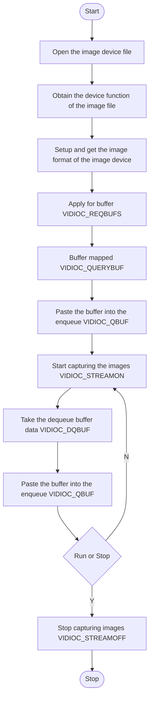
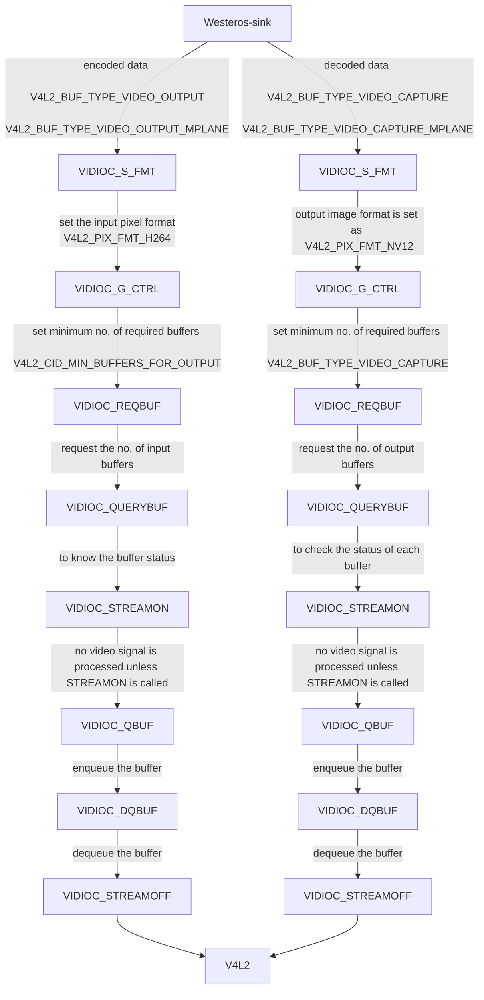

# V4L2 Documentation

## Version History

| Date | Author | Comment | Version |
| --- | --------- | --- | --- |
| 08/08/23 | Premium App Team | First Release | 1.0.0 |

## Table of Contents

- [Description](#description)
  - [Introduction](#introduction)
  - [Repo Details](#repo-details)
  - [Acronyms, Terms and Abbreviations](#acronyms-terms-and-abbreviations)
  - [References](#references)
- [Component Runtime Execution Requirements](#component-runtime-execution-requirements)
  - [Initialization and Startup](#initializatio-and-startup)
  - [Threading Model](#threading-model)
  - [Process Model](#process-model)
  - [Memory Model](#memory-model)
  - [Power Management Requirements](#power-management-requirements)
  - [Asynchronous Notification Model](#asynchronous-notification-model)
  - [Blocking calls](#blocking-calls)
  - [Internal Error Handling](#internal-error-handling)
  - [Persistence Model](#persistence-model)
- [Non-functional requirements](#non-functional-requirements)
  - [Logging and debugging requirements](#logging-and-debugging-requirements)
  - [Memory and performance requirements](#memory-and-performance-requirements)
  - [Quality Control](#quality-control)
  - [Licensing](#licensing)
  - [Build Requirements](#build-requirements)
  - [Variability Management](#variability-management)
  - [Platform or Product Customization](#platform-or-product-customization)
- [Interface API Documentation](#interface-api-documentation)
  - [Theory of operation and key concepts](#theory-of-operation-and-key-concepts)
  - [V4L2 IOCTL for SOC Implementation](#v4l2-ioctl-for-soc-implementation)
  - [Diagrams](#diagrams)
  - [Data Structures and Defines](#data-structures-and-defines)

## Description

### Introduction

Video4Linux2 (V4L2) is a framework for handling video capture and output devices in Linux. In the context of video playback, V4L2 provides an interface for applications to access video output devices such as graphics cards, video encoders/decoders, and displays.
Video4Linux (V4L for short) is a collection of device drivers and an API for supporting realtime video capture on Linux systems. It supports many USB webcams, TV tuners, and related devices, standardizing their output, so programmers can easily add video support to their applications. Video4Linux is responsible for creating V4L2 device nodes aka a device file (/dev/videoX, /dev/vbiX and /dev/radioX) and tracking data from these nodes. The device node creation is handled by V4L device drivers using the video_device struct (v4l2-dev.h) and it can either be allocated dynamically or embedded in another larger struct. V4L2 is the second version of V4L.

This interface provides a set of APIs to facilitate communication through the v4l2 driver via westeros. Westeros uses V4L2 to handle video playback by providing a V4L2 output implementation that can be used by applications to display video content. When a video playback application runs on a device with a supported video output backend, it can use the V4L2 output implementation provided by Westeros to display the video content on the screen. The application sends video frames to the V4L2 output implementation, which in turn uses the V4L2 API to communicate with the underlying video output device.
The V4L2 API provides a set of functions for configuring and controlling video output devices, such as setting the video format, frame rate, and buffer related operations. During video playback, the video frames are sent to the video output device using the V4L2 API, which handles the low-level details of displaying the frames on the screen.

### Repo Details
| Module  | RDK repo | Filepath/Filename  |
| --- | --- | --- |
| V4L2 | https://git.linuxtv.org/linux.git/plain/include/uapi/linux/videodev2.h |  file: linux/videodev2.h |

### Acronyms, Terms and Abbreviations

- `HAL`    - Hardware Abstraction Layer
- `API`    - Application Programming Interface
- `SoC`    - System on Chip
- `V4L2`   - Video For Linux version 2
- `IOCTL`  - Input-Output Control

### References
1. [Video2Linux devices](https://www.kernel.org/doc/html/v4.10/media/kapi/v4l2-core.html)
2. [https://git.linuxtv.org/v4l-utils.git/tree/utils/v4l2-compliance/v4l2-test-formats.cpp](https://git.linuxtv.org/v4l-utils.git/tree/utils/v4l2-compliance/v4l2-test-formats.cpp)
3. [Video4Linux](https://en.wikipedia.org/wiki/Video4Linux)

## Component Runtime Execution Requirements
During  runtime, it is expected of the V4L2 driver to be compatible and interoperable with other software components, such as video encoders, decoders, and display devices, as well as with different hardware platforms.

### Initialization and Startup
Initialization and startup for V4L2 typically involve the following steps:

1. Device Detection: The V4L2 framework scans the system to detect available video devices. It identifies the connected devices and their associated device nodes.

2. Device Opening: Once the desired video device is detected, the V4L2 interface opens the device node to establish communication with the device. This step allows the operating system to send commands and receive data from the video device. We obtain the device function of the image device. Then setup and get the image format of the image device.

3. Device Capabilities Query: After opening the device, the V4L2 framework queries the device for its capabilities. This includes retrieving information about supported video formats, resolutions, frame rates, controls, and other relevant parameters. The capability information helps determine the device's capabilities and available options for video capture and processing. We call VIDIOC_REQBUFS.

4. Stream Configuration: To prepare the video device for capturing video data, the V4L2 interface configures various parameters, such as the desired video format, resolution, and frame rate. This step ensures that the video device is set up correctly for capturing video in the specified format.

5. Memory Mapping: V4L2 provides memory mapping mechanisms to efficiently transfer video frames between the video device and the operating system. This process involves allocating memory buffers in the system, which will be used to store the captured video frames. We call for VIDIOC_QUERYBUF and when buffer is ready, paste the buffer into the enqueue (VIDIOC_QBUF).

6. Stream Activation:  Once the device is properly configured and memory buffers are allocated, the V4L2 interface activates the video stream (VIDIOC_STREAMON). This step starts the flow of video frames from the device to the allocated memory buffers, allowing the operating system to access and process the captured video data.

7. Data Processing and Utilization: Once the video stream is active, the operating system can retrieve the captured video frames from the memory buffers and process them for various purposes. This may include displaying the video feed on a screen (VIDIOC_DQBUF), saving the video to a file, performing real-time analysis, or integrating the video data into other applications.

Overall, the V4L2 functionality in the context of Westeros facilitates the initialization and startup processes for video devices, enabling the operating system to interact with and capture video data from connected devices.

### Threading Model
HAL is expected to be thread safe. There is no restriction on the vendor to create any number of threads to meet the operational requirements. Any caller invoking the APIs should ensure calls are made in a thread safe manner.

### Process Model
This interface is required to support a single instantiation with a single process. VIDIOC_STREAMOFF and VIDIOC_STREAMON allow processes to control the streaming state of a video device, while VIDIOC_DECODER_CMD enables communication with a video decoder device through commands.

1. VIDIOC_STREAMOFF: This API call stops the video streaming for a video device. It is typically invoked by a process to halt the streaming of video frames.

2. VIDIOC_STREAMON: This API call starts the video streaming for a video device. It is typically invoked by a process to resume the streaming of video frames.

3. VIDIOC_DECODER_CMD: This API call sends commands to a video decoder device. The specific commands and their impact on the process model depend on the implementation and hardware capabilities.

### Memory Model
The memory model for V4L2 can be understood by examining the relevant VIDIOC (Video IOCTL) API calls These API calls allow applications to interact with V4L2 and control the memory management for video frames.

1. VIDIOC_REQBUFS: This API call is used to request memory buffers for video frames. It allows the application to specify the desired memory type (check enum v4l2_memory). The memory type determines the memory model to be used.

2. VIDIOC_QUERYBUF: This API call retrieves information about a specific memory buffer. It provides details such as the buffer's length, offset, and memory type. This call is typically used with the V4L2_MEMORY_MMAP memory type to retrieve information about the kernel-space memory buffers.

3. VIDIOC_QBUF: This API call is used to enqueue a buffer for video capture or output. It specifies the buffer's index and memory type, along with other relevant parameters. For memory type V4L2_MEMORY_MMAP, enqueuing the buffer makes it available for capturing video frames or displaying output.

4. VIDIOC_DQBUF: This API call dequeues a buffer that has been filled with a captured video frame or processed output. It provides the index of the dequeued buffer and allows the application to access the video frame stored within the buffer for further processing or display.

5. VIDIOC_EXPBUF: This API call is used to export a memory buffer to a file descriptor, allowing other processes or components to access the buffer directly. VIDIOC_EXPBUF facilitates sharing memory buffers between different components or processes, providing direct access to the buffer's memory.

By utilizing these VIDIOC API functions, applications in Westeros can interact with V4L2 and manage the memory model for video frames. The choice of memory type (V4L2_MEMORY_MMAP or V4L2_MEMORY_DMABUF or other) determines whether the frames are stored in kernel space or user space, respectively, and defines the corresponding memory model.

### Power Management Requirements
There is no requirement for the component to participate in power management. In general, the SoC v4l2 driver should be designed to minimize the power consumption of the device.

### Asynchronous Notification Model
These three API calls, namely VIDIOC_SUBSCRIBE_EVENT, VIDIOC_UNSUBSCRIBE_EVENT, and VIDIOC_DQEVENT, support an asynchronous notification model as they enable the application to receive video events asynchronously, indicating changes or occurrences in the video device or system. Other API's primarily involve configuration, control, streaming, buffer management, or retrieval of information, but they do not have built-in mechanisms for asynchronous event handling or notifications.

1. VIDIOC_SUBSCRIBE_EVENT: This API call allows applications to subscribe to video events generated by a video device asynchronously. Once subscribed, the application can receive notifications about specific events asynchronously, indicating changes or occurrences in the video device.

2. VIDIOC_UNSUBSCRIBE_EVENT: This API call cancels the subscription to video events previously established using VIDIOC_SUBSCRIBE_EVENT. It stops the asynchronous event notifications from being received by the application.

3. VIDIOC_DQEVENT: This API call dequeues a video event generated by a video device. It allows the application to retrieve the event information asynchronously, indicating the occurrence of a specific event.

### Blocking calls
None of the calls in the interface should block. Some API's that should be taken care of are:- VIDIOC_QUERYCAP, VIDIOC_S_FMT, VIDIOC_STREAMON and VIDIOC_DQBUF. The VIDIOC_QUERYCAP call is blocking because it needs to wait for the kernel to return information about the device. The VIDIOC_S_FMT call is blocking because it needs to wait for the kernel to configure the device. The VIDIOC_STREAMON call is blocking because it needs to wait for the kernel to start streaming video data from the device. The VIDIOC_DQBUF call is blocking because it needs to wait for the kernel to return a frame from the device.

### Internal Error Handling
All the APIs must return error synchronously as a return argument. `HAL` is responsible for handling system errors (e.g. out of memory) internally.
Other Common Errors seen:
- EINVAL: for invalid argument
- ENOTTY: if a driver doesn't support any v4l2 ioctl call.
- EPERM: when permission is denied.
- EFAULT: when a failure occurs while copying data from/to userspace, probably caused by an invalid pointer reference.

### Persistence Model
There is no requirement for the interface to persist any setting information. However, please note among the VIDIOC API calls used in Westeros, the following APIs persist information:

1. VIDIOC_G_CTRL: This API call retrieves the current value of a control. The control values can persist between calls, allowing applications to read the control's value consistently.
2. VIDIOC_S_PARM: This API call sets the parameters for video streaming, such as frame rate and buffer size. The parameters set using VIDIOC_S_PARM persist until changed or reset.
3. VIDIOC_S_CTRL: This API call sets the value of a control. The control value persists after the call, affecting the behavior or settings of the video device.
4. VIDIOC_STREAMOFF: This API call stops the video streaming, and the state change persists until VIDIOC_STREAMON is called to resume streaming.
5. VIDIOC_STREAMON: This API call starts the video streaming, and the state change persists until VIDIOC_STREAMOFF is called to stop streaming.
6. VIDIOC_S_FMT: This API call sets the format of the video frames. The format configuration persists until changed or reset.
7. VIDIOC_S_SELECTION: This API call sets the selection rectangle for cropping or composing frames. The selection persists until changed or reset.
These API calls involve setting or changing device configurations, control values, or streaming states, which persist until modified or reset by subsequent API calls.

It's worth noting that some VIDIOC API calls retrieve information without directly persisting it. For example, VIDIOC_QUERYCAP, VIDIOC_QUERYBUF, VIDIOC_ENUM_FRAMESIZES, VIDIOC_ENUM_FMT, and VIDIOC_G_FMT provide information about the device or frame formats but do not modify or persist any settings by themselves. VIDIOC_CROPCAP, VIDIOC_QUERYCTRL, VIDIOC_DECODER_CMD, VIDIOC_SUBSCRIBE_EVENT, VIDIOC_UNSUBSCRIBE_EVENT, VIDIOC_DQEVENT, and VIDIOC_G_SELECTION do not persist information as they primarily retrieve or manipulate the device state temporarily. On the other hand, VIDIOC_REQBUFS, VIDIOC_QBUF, VIDIOC_EXPBUF, and VIDIOC_DQBUF involve buffer management, which can have persistence depending on the specific usage and lifecycle of the buffers.

## Non-functional requirements

### Logging and debugging requirements
This interface is required to support DEBUG, INFO and ERROR messages. DEBUG should be disabled by default and enabled when required.
By logging information like following, the SoC v4l2 driver can provide useful logging and debugging information that can help to identify and troubleshoot any potential errors/issues:
- The values of key parameters, such as the video format, the frame rate, and the control values.
- The state of the driver, such as the current state of the streaming pipeline and the status of the buffers.
- Errors that occur during the execution of the APIs.
- Debug information, such as the values of registers and the state of the hardware. 

### Memory and performance requirements
This interface is required to not cause excessive memory and CPU utilization. Optimize the memory and performance of v4l2 driver to ensure that it can handle necessary high-definition video formats with high frame rates efficiently.

### Quality Control

- This interface is required to perform static analysis, our preferred tool is Coverity.
- Open-source copyright validation is required to be performed, e.g.: Black duck, FossID.
- Have a zero-warning policy with regards to compiling. All warnings are required to be treated as errors.
- Use of memory analysis tools like Valgrind are encouraged, to identify leaks/corruptions.
- Tests will endeavour to create worst case scenarios to assist investigations.

### Licensing
The `HAL` implementation is expected to released under the Apache License 2.0.

### Build Requirements
You need to have a video device (i.e. webcam, tuner card, etc.) connected to your system and available under /dev/video. If you don't have any hardware device available, you can still test the "Virtual Video Driver". To compile this you need to compile your kernel with CONFIG_VIDEO_VIVI=m
under:
- Device Drivers
- Multimedia devices
- Video For Linux
- Video capture adapters
- Virtual Video Driver
With this, you can execute v4l-test.

### Variability Management
Any changes in the APIs should be reviewed and approved by the component architects. Further support may be added to test any specific requirements of the target platform or product.

### Platform or Product Customization
No product customization is expected from SoC vendors from this module. The v4l2 test suite comes with a set of pre-defined test cases that cover a range of v4l2 ioctl calls. The test cases if are not sufficient for testing all the features of a specific platform or product then modifucation/customization of the test cases will be done by creating new test cases or modifying existing ones to better suit the requirements of the target platform or product.

## Interface API Documentation
`API` documentation will be provided by Doxygen which will be generated from the header files.

### Theory of operation and key concepts
The V4L2 functionality provided by Westeros enables video playback applications to easily display video content on a variety of embedded Linux devices with different video output capabilities.
- V4L2 framework provides a standardized and flexible interface for working with video devices on Linux-based systems. By providing a common API for accessing and controlling video devices, V4L2 simplifies the development of video applications and drivers, and enables interoperability across different hardware platforms and drivers. 
- For example, when a user-space application requests a video frame, the V4L2 driver captures the frame from the device using the configured communication channels and stores it in a buffer. The user-space application can then read the frame from the buffer and process it as needed. Similarly, when a user-space application requests output to a display device, the V4L2 driver outputs the video frames to the appropriate destination.
- The V4L2 IOCTL calls are mainly being invoked from the Westeros-sink. Currently Westeros have 34 IOCTL calls in the ioctl_wrapper function, but it only uses 23 IOCTLS. Those are mentioned below:

VIDIOC_CROPCAP
VIDIOC_G_CTRL
VIDIOC_S_PARM,
VIDIOC_QUERYCTRL
VIDIOC_S_CTRL
VIDIOC_STREAMOFF
VIDIOC_STREAMON
VIDIOC_DECODER_CMD
VIDIOC_QUERYCAP
VIDIOC_SUBSCRIBE_EVENT
VIDIOC_UNSUBSCRIBE_EVENT
VIDIOC_DQEVENT
VIDIOC_S_FMT
VIDIOC_G_FMT
VIDIOC_ENUM_FRAMESIZES
VIDIOC_ENUM_FMT
VIDIOC_QUERYBUF
VIDIOC_REQBUFS
VIDIOC_QBUF
VIDIOC_EXPBUF
VIDIOC_DQBUF
VIDIOC_G_SELECTION
VIDIOC_S_EXT_CTRLS

And IOCTLs not being used in westeros module are:
VIDIOC_G_FBUF
VIDIOC_S_FBUF
VIDIOC_OVERLAY
VIDIOC_ENUMINPUT
VIDIOC_G_PARM
VIDIOC_G_STD
VIDIOC_S_STD
VIDIOC_ENUMSTD
VIDIOC_TRY_FMT
VIDIOC_CREATE_BUFS
VIDIOC_S_SELECTION

### V4L2 IOCTL for SOC Implementation

| Sl. no.  | IOCTL Call        | About                | Description              | Synopsis                     |
| -------- | ----------------- | -------------------- | ------------------------ | ---------------------------- |
| 1	| VIDIOC_QUERYCAP | Query device capabilities	| All V4L2 devices support the VIDIOC_QUERYCAP ioctl. It is used to identify kernel devices compatible with this specification and to obtain information about driver and hardware capabilities. The ioctl takes a pointer to a struct v4l2_capability which is filled by the driver. When the driver is not compatible with this specification the ioctl returns an EINVAL error code.	| https://www.kernel.org/doc/html/v4.8/media/uapi/v4l/vidioc-querycap.html#_CPPv25ioctliiP15v4l2_capability	|
| 2	| VIDIOC_ENUM_FMT	| Enumerate image formats	| To enumerate image formats applications initialize the type and index field of struct v4l2_fmtdesc and call the ioctl VIDIOC_ENUM_FMT ioctl with a pointer to this structure. Drivers fill the rest of the structure or return an EINVAL error code. All formats are enumerable by beginning at index zero and incrementing by one until EINVAL is returned.	| https://www.kernel.org/doc/html/v4.8/media/uapi/v4l/vidioc-enum-fmt.html	|
| 3	| VIDIOC_G_FMT	| Get the data format (typically image format) exchanged b/w driver & application.	| To query the current parameters applications set the type field of a struct struct v4l2_format to the respective buffer (stream) type. For example, video capture devices use V4L2_BUF_TYPE_VIDEO_CAPTURE or V4L2_BUF_TYPE_VIDEO_CAPTURE_MPLANE. When the application calls the VIDIOC_G_FMT ioctl with a pointer to this structure the driver fills the respective member of the fmt union. When the requested buffer type is not supported drivers return an EINVAL error code.	| https://www.kernel.org/doc/html/v4.8/media/uapi/v4l/vidioc-g-fmt.html	|
| 4	| VIDIOC_S_FMT	| Set the data format (typically image format) exchanged b/w driver & application	| When the application calls the VIDIOC_S_FMT ioctl with a pointer to a struct v4l2_format structure the driver checks and adjusts the parameters against hardware abilities. Drivers should not return an error code unless the type field is invalid, this is a mechanism to fathom device capabilities and to approach parameters acceptable for both the application and driver. On success the driver may program the hardware, allocate resources and generally prepare for data exchange. Finally, the VIDIOC_S_FMT ioctl returns the current format parameters as VIDIOC_G_FMT does. 	| https://www.kernel.org/doc/html/v4.8/media/uapi/v4l/vidioc-g-fmt.html	|
| 5	| VIDIOC_REQBUFS	| Initiate Memory Mapping | User Pointer I/O or DMA buffer I/O	To allocate device buffers applications initialize all fields of the struct v4l2_requestbuffers structure. They set the type field to the respective stream or buffer type, the count field to the desired number of buffers, memory must be set to the requested I/O method and the reserved array must be zeroed. When the ioctl is called with a pointer to this structure the driver will attempt to allocate the requested number of buffers and it stores the actual number allocated in the count field. For example, video output requires at least two buffers, one displayed and one filled by the application. When the I/O method is not supported the ioctl returns an EINVAL error code.	| https://www.kernel.org/doc/html/v4.8/media/uapi/v4l/vidioc-reqbufs.html	|
| 6	| VIDIOC_QUERYBUF	| Query the status of a buffer.	| Applications set the type field of a struct v4l2_buffer to the same buffer type as was previously used with struct v4l2_format type and struct v4l2_requestbuffers type, and the index field. Valid index numbers range from zero to the number of buffers allocated with ioctl VIDIOC_REQBUFS (struct v4l2_requestbuffers count) minus one. The reserved and reserved2 fields must be set to 0. After calling ioctl VIDIOC_QUERYBUF with a pointer to this structure drivers return an error code or fill the rest of the structure.	| https://www.kernel.org/doc/html/v4.8/media/uapi/v4l/vidioc-querybuf.html	|
| 7	| VIDIOC_G_FBUF	| Get frame buffer overlay parameters.	| To get the current parameters applications call the VIDIOC_G_FBUF ioctl with a pointer to a struct v4l2_framebuffer structure. The driver fills all fields of the structure or returns an EINVAL error code when overlays are not supported.	| https://www.kernel.org/doc/html/v4.8/media/uapi/v4l/vidioc-g-fbuf.html	|
| 8	| VIDIOC_S_FBUF	| Set frame buffer overlay parameters.	| To set the parameters for a Video Output Overlay, applications must initialize the flags field of a struct struct v4l2_framebuffer. Since the framebuffer is implemented on the TV card all other parameters are determined by the driver. When an application calls VIDIOC_S_FBUF with a pointer to this structure, the driver prepares for the overlay and returns the framebuffer parameters as VIDIOC_G_FBUF does, or it returns an error code. \n To set the parameters for a non-destructive Video Overlay, applications must initialize the flags field, the fmt substructure, and call VIDIOC_S_FBUF. \n For a destructive Video Overlay applications must additionally provide a base address. | https://www.kernel.org/doc/html/v4.8/media/uapi/v4l/vidioc-g-fbuf.html	|
| 9	| VIDIOC_OVERLAY	| Start or stop video overlay	| This ioctl is part of the video overlay I/O method. Applications call ioctl VIDIOC_OVERLAY to start or stop the overlay. It takes a pointer to an integer which must be set to zero by the application to stop overlay, to one to start. Drivers do not support ioctl VIDIOC_STREAMON, VIDIOC_STREAMOFF or VIDIOC_STREAMOFF with V4L2_BUF_TYPE_VIDEO_OVERLAY.  | https://www.kernel.org/doc/html/v4.8/media/uapi/v4l/vidioc-overlay.html	|
| 10	| VIDIOC_QBUF	| Exchange a buffer with the driver	| Applications call the VIDIOC_QBUF ioctl to enqueue an empty (capturing) or filled (output) buffer in the driver’s incoming queue. The semantics depend on the selected I/O method. \n To enqueue a memory mapped buffer applications set the memory field to V4L2_MEMORY_MMAP. When VIDIOC_QBUF is called with a pointer to this structure the driver sets the V4L2_BUF_FLAG_MAPPED and V4L2_BUF_FLAG_QUEUED flags and clears the V4L2_BUF_FLAG_DONE flag in the flags field, or it returns an EINVAL error code. \n To enqueue a user pointer buffer applications set the memory field to V4L2_MEMORY_USERPTR, the m.userptr field to the address of the buffer and length to its size. To enqueue a DMABUF buffer applications set the memory field to V4L2_MEMORY_DMABUF & m.fd field to file descriptor associated with a DMABUF buffer. | https://www.kernel.org/doc/html/v4.8/media/uapi/v4l/vidioc-qbuf.html	|
| 11	| VIDIOC_EXPBUF	| Export a buffer as a DMABUF file descriptor	| This ioctl is an extension to the memory mapping I/O method, hence it is available only for V4L2_MEMORY_MMAP buffers. To export a buffer, applications fill struct v4l2_exportbuffer. The type field is set to the same buffer type as was previously used with struct v4l2_requestbuffers type. Applications must also set the index field. Valid index numbers range from zero to the number of buffers allocated with ioctl VIDIOC_REQBUFS (struct v4l2_requestbuffers count) minus one. Additional flags may be posted in the flags field. After calling ioctl VIDIOC_EXPBUF the fd field will be set by a driver. | https://www.kernel.org/doc/html/v4.8/media/uapi/v4l/vidioc-expbuf.html	|
| 12	| VIDIOC_DQBUF	| Exchange a buffer with the driver	| Applications call the VIDIOC_DQBUF ioctl to dequeue a filled (capturing) or displayed (output) buffer from the driver’s outgoing queue. They just set the type, memory and reserved fields of a struct v4l2_buffer as above, when VIDIOC_DQBUF is called with a pointer to this structure the driver fills the remaining fields or returns an error code. The driver may also set V4L2_BUF_FLAG_ERROR in the flags field. By default, VIDIOC_DQBUF blocks when no buffer is in the outgoing queue. | https://www.kernel.org/doc/html/v4.8/media/uapi/v4l/vidioc-qbuf.html	|
| 13	| VIDIOC_STREAMON	| Start streaming I/O	| This ioctl start the capture or output process during streaming (memory mapping, user pointer or DMABUF) I/O. \n Capture hardware is disabled and no input buffers are filled (if there are any empty buffers in the incoming queue) until VIDIOC_STREAMON has been called. Output hardware is disabled and no video signal is produced until VIDIOC_STREAMON has been called. The ioctl will succeed when at least one output buffer is in the incoming queue. Memory-to-memory devices will not start until VIDIOC_STREAMON has been called for both the capture and output stream types. \n If VIDIOC_STREAMON fails, then any already queued buffers will remain queued. | https://www.kernel.org/doc/html/v4.8/media/uapi/v4l/vidioc-streamon.html	|
| 14	| VIDIOC_STREAMOFF	| Stop streaming I/O	| The VIDIOC_STREAMOFF ioctl, apart from aborting or finishing any DMA in progress, unlocks any user pointer buffers locked in physical memory, and it removes all buffers from the incoming and outgoing queues. That means all images captured but not dequeued yet will be lost, likewise all images enqueued for output but not transmitted yet. I/O returns to the same state as after calling ioctl VIDIOC_REQBUFS and can be restarted accordingly.| https://www.kernel.org/doc/html/v4.8/media/uapi/v4l/vidioc-streamon.html	|
| 15	| VIDIOC_G_PARM	| Get streaming parameters.	| The current video standard determines a nominal number of frames per second. If less than this number of frames is to be captured or output, applications can request frame skipping or duplicating on the driver side. This is especially useful when using the read() or write(), which are not augmented by timestamps or sequence counters, and to avoid unnecessary data copying. Further get/set can be used to determine the number of buffers used internally by a driver in read/write mode. For implications see the section discussing the read() function. \n To get the streaming parameters applications call the VIDIOC_G_PARM ioctl. It takes a pointer to a struct struct v4l2_streamparm which contains a union holding separate parameters for input and output devices. | https://www.kernel.org/doc/html/v4.8/media/uapi/v4l/vidioc-g-parm.html	|
| 16	| VIDIOC_S_PARM	| Set streaming parameters.	| To set the streaming parameters applications call the VIDIOC_S_PARM ioctl. It takes a pointer to a struct struct v4l2_streamparm which contains a union holding separate parameters for input and output devices.| https://www.kernel.org/doc/html/v4.8/media/uapi/v4l/vidioc-g-parm.html	|
| 17	| VIDIOC_G_STD	| Query the video standard of the current input	| It takes a pointer to a v4l2_std_id type as argument. VIDIOC_G_STD can return a single flag or a set of flags as in struct v4l2_standard field id. The flags must be unambiguous such that they appear in only one enumerated struct v4l2_standard structure.| https://www.kernel.org/doc/html/v4.8/media/uapi/v4l/vidioc-g-std.html	|
| 18	| VIDIOC_S_STD	| Select the video standard of the current input.	| It takes a pointer to a v4l2_std_id type as argument. VIDIOC_G_STD can return a single flag or a set of flags as in struct v4l2_standard field id. The flags must be unambiguous such that they appear in only one enumerated struct v4l2_standard structure. \n VIDIOC_S_STD accepts one or more flags, being a write-only ioctl it does not return the actual new standard as VIDIOC_G_STD does. | https://www.kernel.org/doc/html/v4.8/media/uapi/v4l/vidioc-g-std.html	|
| 19	| VIDIOC_ENUMSTD	| Enumerate supported video standards	| To query the attributes of a video standard, especially a custom (driver defined) one, applications initialize the index field of struct v4l2_standard and call the ioctl VIDIOC_ENUMSTD ioctl with a pointer to this structure. Drivers fill the rest of the structure or return an EINVAL error code when the index is out of bounds. To enumerate all standards applications shall begin at index zero, incrementing by one until the driver returns EINVAL. Drivers may enumerate a different set of standards after switching the video input or output.	| https://www.kernel.org/doc/html/v4.8/media/uapi/v4l/vidioc-enumstd.html	|
| 20	| VIDIOC_ENUMINPUT	| Enumerate video inputs	| To query the attributes of a video input applications initialize the index field of struct v4l2_input and call the ioctl VIDIOC_ENUMINPUT ioctl with a pointer to this structure. Drivers fill the rest of the structure or return an EINVAL error code when the index is out of bounds. To enumerate all inputs applications shall begin at index zero, incrementing by one until the driver returns EINVAL.	| https://www.kernel.org/doc/html/v4.8/media/uapi/v4l/vidioc-enuminput.html	|
| 21	| VIDIOC_G_CTRL	| Get the value of a control.	| To get the current value of a control applications initialize the id field of a struct struct v4l2_control and call the VIDIOC_G_CTRL ioctl with a pointer to this structure. Works only with user controls.	| https://www.kernel.org/doc/html/v4.8/media/uapi/v4l/vidioc-g-ctrl.html	|
| 22	| VIDIOC_S_CTRL	| Set the value of a control.	| To change the value of a control applications, initialize the id and value fields of a struct struct v4l2_control and call the VIDIOC_S_CTRL ioctl. VIDIOC_S_CTRL is a write-only ioctl, it does not return the actual new value. Works only with user controls.	| https://www.kernel.org/doc/html/v4.8/media/uapi/v4l/vidioc-g-ctrl.html	|
| 23	| VIDIOC_QUERYCTRL	| Enumerate controls	| To query the attributes of a control applications set the id field of a struct v4l2_queryctrl and call the VIDIOC_QUERYCTRL ioctl with a pointer to this structure. The driver fills the rest of the structure or returns an EINVAL error code when the id is invalid. It is possible to enumerate controls by calling VIDIOC_QUERYCTRL with successive id values starting from V4L2_CID_BASE up to and exclusive V4L2_CID_LASTP1. Drivers may return EINVAL if control in this range is not supported.	| https://www.kernel.org/doc/html/v4.8/media/uapi/v4l/vidioc-queryctrl.html	|
| 24	| VIDIOC_ENUM_FRAMESIZES  | Enumerate frame sizes.	| This ioctl allows applications to enumerate all frame sizes (i. e. width and height in pixels) that the device supports for the given pixel format. The supported pixel formats can be obtained by using the ioctl VIDIOC_ENUM_FMT function. \n The return value and the content of the v4l2_frmsizeenum. type field depend on the type of frame sizes the device supports. When the application calls the function with index zero, it must check the type field to determine the type of frame size enumeration the device supports. | https://www.kernel.org/doc/html/v4.8/media/uapi/v4l/vidioc-enum-framesizes.html	|
| 25	| VIDIOC_TRY_FMT	| Try a data format.	| The VIDIOC_TRY_FMT ioctl is equivalent to VIDIOC_S_FMT with 1 exception: it does not change driver state. It can also be called at any time, never returning EBUSY. This function is provided to negotiate parameters, to learn about hardware limitations, without disabling I/O or possibly time-consuming hardware preparations. Although strongly recommended drivers are not required to implement this ioctl. The format as returned by VIDIOC_TRY_FMT must be identical to what VIDIOC_S_FMT returns for the same i/p or o/p. | https://www.kernel.org/doc/html/v4.8/media/uapi/v4l/vidioc-g-fmt.html	|
| 26	| VIDIOC_CROPCAP	| Information about the video cropping and scaling abilities	| Applications use this function to query the cropping limits, the pixel aspect of images and to calculate scale factors. They set the type field of a v4l2_cropcap structure to the respective buffer (stream) type and call the ioctl VIDIOC_CROPCAP ioctl with a pointer to this structure. Drivers fill the rest of the structure. The results are constant except when switching the video standard. Remember this switch can occur implicit when switching the video input or output.This ioctl must be implemented for video capture or output devices that support cropping and/or scaling and/or have non-square pixels, and for overlay devices.| https://www.kernel.org/doc/html/v4.8/media/uapi/v4l/vidioc-cropcap.html	|
| 27	| VIDIOC_CREATE_BUFS	| Create buffers for Memory Mapped or User Pointer or DMA Buffer I/O	| This can be used as an alternative or in addition to the ioctl VIDIOC_REQBUFS ioctl, when a tighter control over buffers is required. This ioctl can be called multiple times to create buffers of different sizes. To allocate the device buffers applications must initialize the relevant fields of the struct v4l2_create_buffers structure. The count field must be set to the number of requested buffers, the memory field specifies the requested I/O method and the reserved array must be zeroed. The format field specifies the image format that the buffers must be able to handle. \n When the ioctl is called with a pointer to this structure the driver will attempt to allocate up to the requested number of buffers and store the actual number allocated and the starting index in the count and the index fields respectively. On return count can be smaller than the number requested.| https://www.kernel.org/doc/html/v4.8/media/uapi/v4l/vidioc-create-bufs.html	|
| 28	| VIDIOC_G_SELECTION	| Get one of the selection rectangles	| To query the cropping (composing) rectangle set struct v4l2_selection type field to the respective buffer type. Do not use the multiplanar buffer types. The next step is setting the value of struct v4l2_selection target field to V4L2_SEL_TGT_CROP (V4L2_SEL_TGT_COMPOSE). The flags and reserved fields of struct v4l2_selection is ignored, and they must be filled with zeros. The driver fills the rest of the structure or returns EINVAL error code if incorrect buffer type or target was used. If cropping (composing) is not supported, then the active rectangle is not mutable, and it is always equal to the bounds rectangle. Finally, the struct v4l2_rect r rectangle is filled with the current cropping (composing) coordinates. 	| https://www.kernel.org/doc/html/v4.8/media/uapi/v4l/vidioc-g-selection.html|
| 29	| VIDIOC_SUBSCRIBE_EVENT	|  Subscribe event	| Subscribe V4L2 event. Subscribed events are dequeued by using the ioctl VIDIOC_DQEVENT ioctl.	| https://www.kernel.org/doc/html/v4.9/media/uapi/v4l/vidioc-subscribe-event.html	|
| 30	| VIDIOC_UNSUBSCRIBE_EVENT	|  Unsubscribe event	| Unsubscribe V4L2 event. Subscribed events are dequeued by using the ioctl VIDIOC_DQEVENT ioctl.	| https://www.kernel.org/doc/html/v4.9/media/uapi/v4l/vidioc-subscribe-event.html	|
| 31	| VIDIOC_DQEVENT	| Dequeue event	| Dequeue an event from a video device. No input is required for this ioctl. All the fields of the struct v4l2_event structure are filled by the driver. The file handle will also receive exceptions which the application may get by e.g. using the select system call.	| https://www.kernel.org/doc/html/v4.9/media/uapi/v4l/vidioc-dqevent.html	|
| 32	| VIDIOC_DECODER_CMD	| Execute an decoder command	| These ioctls control an audio/video (usually MPEG-) decoder. VIDIOC_DECODER_CMD sends a command to the decoder, VIDIOC_TRY_DECODER_CMD can be used to try a command without actually executing it. To send a command applications must initialize all fields of a struct v4l2_decoder_cmd and call VIDIOC_DECODER_CMD or VIDIOC_TRY_DECODER_CMD with a pointer to this structure. The cmd field must contain the command code. Some commands use the flags field for additional information. These ioctls are optional, not all drivers may support them. They were introduced in Linux 3.3.	| https://www.kernel.org/doc/html/v4.9/media/uapi/v4l/vidioc-decoder-cmd.html	|
| 33	| VIDIOC_S_SELECTION	| Set one of the selection rectangles	| To change the cropping (composing) rectangle set the struct v4l2_selection type field to the respective buffer type. Do not use multiplanar buffers. Use V4L2_BUF_TYPE_VIDEO_CAPTURE instead of V4L2_BUF_TYPE_VIDEO_CAPTURE_MPLANE. Use V4L2_BUF_TYPE_VIDEO_OUTPUT instead of V4L2_BUF_TYPE_VIDEO_OUTPUT_MPLANE. The next step is setting the value of struct v4l2_selection target to V4L2_SEL_TGT_CROP (V4L2_SEL_TGT_COMPOSE). Please refer to table Common selection definitions or API for cropping, composing and scaling for additional targets. The struct v4l2_rect r rectangle need to be set to the desired active area. Field struct v4l2_selection reserved is ignored and must be filled with zeros. The driver may adjust coordinates of the requested rectangle. An application may introduce constraints to control rounding behaviour. The driver may have to adjusts the requested dimensions against hardware limits and other parts as the pipeline, i.e. the bounds given by the capture/output window or TV display. The closest possible values of horizontal and vertical offset and sizes are chosen according to given priority.	| https://www.kernel.org/doc/html/v4.9/media/uapi/v4l/vidioc-g-selection.html	|
| 34	| VIDIOC_S_EXT_CTRLS	| Set the value of several controls	| To change the value of a set of controls applications initialize the id, size, reserved2 and value/value64/string/ptr fields of each struct v4l2_ext_control and call the VIDIOC_S_EXT_CTRLS ioctl. The controls will only be set if all control values are valid. The driver will only set/get these controls if all control values are correct. This prevents the situation where only some of the controls were set/get. Only low-level errors (e. g. a failed i2c command) can still cause this situation.	| https://www.kernel.org/doc/html/v4.9/media/uapi/v4l/vidioc-g-ext-ctrls.html	|

### Diagrams

#### IOCTL code-flow during capturing images

#### IOCTL general code-flow

### Data Structures and Defines
SoC vendors should refer to the header files under the 'include' directory for API implementation.
Refer the '<a href="files.html">Files</a>' section: https://github.com/rdkcentral/v4l2-halif/blob/rdk-dev/include/
