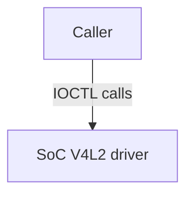
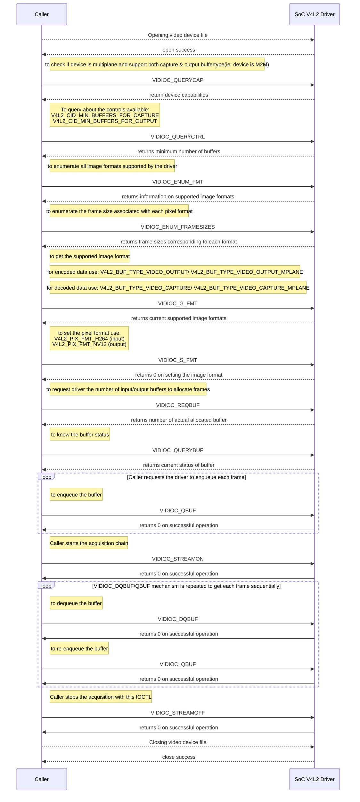
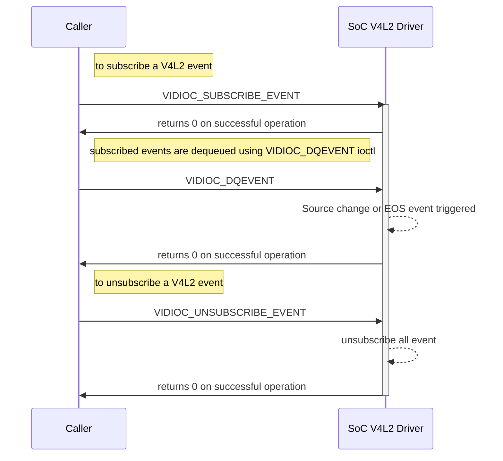

# V4L2 Documentation

## Version History

| Date [DD/MM/YY] | Comment | Version |
| --- | --- | --- |
| 08/08/23 | First Release | 1.0.0 |

## Table of Contents

- [Description](#description)
  - [Introduction](#introduction)
  - [Acronyms, Terms and Abbreviations](#acronyms-terms-and-abbreviations)
  - [References](#references)
- [Component Runtime Execution Requirements](#component-runtime-execution-requirements)
  - [Initialization and Startup](#initializatio-and-startup)
  - [Threading Model](#threading-model)
  - [Process Model](#process-model)
  - [Memory Model](#memory-model)
  - [Power Management Requirements](#power-management-requirements)
  - [Asynchronous Notification Model](#asynchronous-notification-model)
  - [Blocking calls](#blocking-calls)
  - [Internal Error Handling](#internal-error-handling)
  - [Persistence Model](#persistence-model)
- [Non-functional requirements](#non-functional-requirements)
  - [Logging and debugging requirements](#logging-and-debugging-requirements)
  - [Memory and performance requirements](#memory-and-performance-requirements)
  - [Quality Control](#quality-control)
  - [Licensing](#licensing)
  - [Build Requirements](#build-requirements)
  - [Variability Management](#variability-management)
  - [Platform or Product Customization](#platform-or-product-customization)
- [Interface API Documentation](#interface-api-documentation)
  - [Theory of operation and key concepts](#theory-of-operation-and-key-concepts)
  - [V4L2 IOCTL for SOC Implementation](#v4l2-ioctl-for-soc-implementation)
  - [Diagrams](#diagrams)
   - [IOCTL callflow during capturing images](#ioctl-callflow-during-capturing-images)
   - [General IOCTL callflow](#general-ioctl-callflow)
  - [Data Structures and Defines](#data-structures-and-defines)

## Description
This interface provides a set of `IOCTL` calls that are required to be supported by the `SoC`'s `V4L2` driver. Any of the layers calling the `V4L2`, should be referred as `Caller`.  
The diagram below shows the interaction between `Caller` and `SoC` `V4L2` Driver.

### Introduction
Video4Linux2 (`V4L2`) is a framework for handling video capture and output devices in Linux. In the context of video playback, `V4L2` provides an interface for applications to access video output devices such as graphics cards, video encoders/decoders, and displays.
Video4Linux (V4L for short) is a collection of device drivers and an `API` for supporting realtime video capture on Linux systems. Video4Linux is responsible for creating `V4L2` device nodes aka a device file (/dev/videoX) and tracking data from these nodes. The device node creation is handled by V4L device drivers using the video_device struct (v4l2-dev.h) and it can either be allocated dynamically or embedded in another larger struct. `V4L2` is the second version of V4L.

The `V4L2` `IOCTL` calls provides a set of `IOCTL` calls for configuring and controlling video output devices, such as setting the video format, frame rate, and buffer related operations. During video playback, the video frames are sent to the video output device using the `V4L2` `IOCTL` calls, which handles the low-level details of displaying the frames on the screen. 

### Acronyms, Terms and Abbreviations

- `HAL`    - Hardware Abstraction Layer
- `API`    - Application Programming Interface
- `Caller` - Any user of the interface via the IOCTLs
- `SoC`    - System on Chip
- `V4L2`   - Video For Linux version 2
- `IOCTL`  - Input-Output Control

### References
Video4Linux Devices Specifications - [Video4Linux devices](https://www.kernel.org/doc/html/v5.4/media/kapi/v4l2-core.html)

## Component Runtime Execution Requirements
The `V4L2` driver provides the interface between the application and the video device. Once the application successfully opens the video device file (available as /dev/videoX; where X is a non-negative integer) with read and write permissions (O_RDWR) using the `open`() system call and sets the O_CLOEXEC flag, it can then use subsequent `V4L2`-specific `IOCTL` calls to interact with the driver and perform operations.

These requirements ensure that the `HAL` executes correctly within the run-time environment that it will be used in. Failure to meet these requirements will likely result in undefined and unexpected behaviour.

### Initialization and Startup
Initialization and startup for `V4L2` typically involve the following steps:

1. Device Detection and Opening: The application initiates the process by detecting (using `opendir`() & `readdir`() functions and creating full path) and attempting to open the video device file using the `open`() system call under the /dev/ directory. The operating system's file system layer handles the mapping of the specified device file to the corresponding driver. The `V4L2` driver, once accessed through the opened device file, provides the necessary interface for the application to communicate with the video device.

2. Device Capabilities Query: After opening the device, `Caller` shall query the V4L2 framework for its capabilities using `VIDIOC_QUERYCAP`. This includes retrieving information about supported video formats, resolutions, frame rates, controls, and other relevant parameters. The capability information helps determine the device's capabilities and available options for video capture and processing. We call `VIDIOC_REQBUFS`.

3. Stream Configuration: To prepare the video device for capturing video data, the `V4L2` interface configures various parameters, such as the desired video format, resolution, and frame rate. This step ensures that the video device is set up correctly for capturing video in the specified format.

4. Memory Mapping: `V4L2` provides memory mapping mechanisms to efficiently transfer video frames between the video device and the operating system. This process involves allocating memory buffers in the system, which will be used to store the captured video frames. We call for VIDIOC_QUERYBUF and when buffer is ready, paste the buffer into the enqueue (`VIDIOC_QBUF`).

5. Stream Activation:  Once the device is properly configured and memory buffers are allocated, the `V4L2` interface activates the video stream (`VIDIOC_STREAMON`). This step starts the flow of video frames from the device to the allocated memory buffers, allowing the operating system to access and process the captured video data.

6. Data Processing and Utilization: Once the video stream is active, the operating system can retrieve the captured video frames from the memory buffers and process them for various purposes. This may include displaying the video feed on a screen (`VIDIOC_DQBUF`), saving the video to a file, performing real-time analysis, or integrating the video data into other applications.

Overall, the `V4L2` functionality should facilitates the initialization and startup processes for video devices by enabling the operating system to interact with and capture video data from connected devices.

### Threading Model
`HAL` is expected to be thread safe. Any `Caller` invoking the `API`'s should ensure calls are made in a thread safe manner. There is no restriction on the vendor to create any number of threads to meet the operational requirements. 

### Process Model
This interface supports multiple instantiation with a single process. `V4L2` is a kernel-level `API` that allows multiple processes to access the same video device. This is done by creating multiple file descriptors for the same device node. Each process can then use its own file descriptor to control and access the device. 
`V4L2` devices can be opened more than once if this is supported by the driver. Merely opening a `V4L2` device does not grant exclusive access. Initiating data exchange however assigns the right to read or write the requested type of data, and to change related properties, to this file descriptor. Applications can request additional access privileges using the priority mechanism. Refer: https://www.kernel.org/doc/html/next/userspace-api/media/v4l/open.html 

### Memory Model
The memory model of this interface needs to be taken care by the `SoC`'s `V4L2` driver only, with respect to the `IOCTL` calls which are required by the `Caller`. By utilizing these `IOCTL` calls, applications will interact with `V4L2` and manage the memory model for video frames. The choice of memory type will be done by the `Caller` and `V4L2` driver should be able to support these two memory types: `V4L2_MEMORY_MMAP` and `V4L2_MEMORY_DMABUF`.

### Power Management Requirements
There is no requirement for the component to participate in power management. In general, the `SoC` `V4L2` driver should be designed to minimize the power consumption of the device.

### Asynchronous Notification Model
These three `API` calls, namely `VIDIOC_SUBSCRIBE_EVENT`, `VIDIOC_UNSUBSCRIBE_EVENT`, and `VIDIOC_DQEVENT`, support an asynchronous notification model as they enable the application to receive video events asynchronously, indicating changes or occurrences in the video device or system. Other `API`'s primarily involve configuration, control, streaming, buffer management, or retrieval of information, but they do not have built-in mechanisms for asynchronous event handling or notifications.

1. `VIDIOC_SUBSCRIBE_EVENT`: This `API` call allows applications to subscribe to video events generated by a video device asynchronously. Once subscribed, the application can receive notifications about specific events asynchronously, indicating changes or occurrences in the video device.

2. `VIDIOC_UNSUBSCRIBE_EVENT`: This `API` call cancels the subscription to video events previously established using `VIDIOC_SUBSCRIBE_EVENT`. It stops the asynchronous event notifications from being received by the application.

3. `VIDIOC_DQEVENT`: This `API` call dequeues a video event generated by a video device. It allows the application to retrieve the event information asynchronously, indicating the occurrence of a specific event.

The `V4L2` driver is required to support these 4 event types: `V4L2_EVENT_ALL`, `V4L2_EVENT_SRC_CH_RESOLUTION`, `V4L2_EVENT_SOURCE_CHANGE` and `V4L2_EVENT_EOS`. Refer: https://www.kernel.org/doc/html/v4.9/media/uapi/v4l/vidioc-dqevent.html#event-type

### Blocking calls
None of the calls in the interface should block.

### Internal Error Handling
All the `API`'s must return error synchronously as a return argument. `HAL` is responsible for handling system errors (e.g. out of memory) internally.

### Persistence Model
There is no requirement for the interface to persist any setting information. 

## Non-functional requirements

### Logging and debugging requirements
This interface is required to support DEBUG, INFO and ERROR messages. ERROR logs should be enabled by default. DEBUG and INFO is required to be disabled by default and enabled when needed.

### Memory and performance requirements
This interface is required to not cause excessive memory and CPU utilization.

### Quality Control

- This interface is required to perform static analysis, our preferred tool is Coverity.
- Have a zero-warning policy with regards to compiling. All warnings are required to be treated as error.
- Copyright validation is required to be performed, e.g.: Black duck, FossID.
- Use of memory analysis tools like Valgrind are encouraged, to identify leaks/corruptions.
- `HAL` Tests will endeavour to create worst case scenarios to assist investigations.
- Improvements by any party to the testing suite are required to be fed back.

### Licensing
The `HAL` implementation is expected to released under the Apache License 2.0.

### Build Requirements
`V4L2` driver will be implemented as a kernel module. `SoC` team is expected to handle the compilation of `V4L2` driver as part of kernel and need to enable the configuration options required for adding `V4L2` driver in the kernel for supporting V4L protocol based decoding components. The driver modules plug into the videodev kernel module. Also, the driver's linux kernel is expected to be at least 5.4.0. Refer: https://www.kernelconfig.io/index.html

The build mechanism should be independent of Yocto.  

### Variability Management
Any changes in the `API`'s should be reviewed and approved by the component architects. Further support may be added to test any specific requirements of the target platform or product.

### Platform or Product Customization
No product customization is expected from `SoC` vendors from this module. The `V4L2` test suite comes with a set of pre-defined test cases that cover a range of `V4L2` `IOCTL` calls. The test cases if are not sufficient for testing all the features of a specific platform or product then modification/customization of the test cases will be done by creating new test cases or modifying existing ones to better suit the requirements of the target platform or product.

## Interface API Documentation
`API` documentation will be provided by Doxygen which will be generated from the header files.

### Theory of operation and key concepts
The Caller is expected to have complete control over calling the `V4L2` `IOCTL`s.

The `V4L2` functionality enables video playback applications to easily display video content on a variety of embedded Linux devices with different video output capabilities.

- `V4L2` framework provides a standardized and flexible interface for working with video devices on Linux-based systems. By providing a common `API` for accessing and controlling video devices, `V4L2` simplifies the development of video applications and drivers, and enables interoperability across different hardware platforms and drivers. 

- For example, when a user-space application requests a video frame, the `V4L2` driver captures the frame from the device using the configured communication channels and stores it in a buffer. The user-space application can then read the frame from the buffer and process it as needed. Similarly, when a user-space application requests output to a display device, the `V4L2` driver outputs the video frames to the appropriate destination.

- For `SoC` Implementation, `V4L2` driver is required to support these 23 `IOCTL` calls:

`VIDIOC_CROPCAP`, `VIDIOC_G_CTRL`, `VIDIOC_S_PARM`, `VIDIOC_QUERYCTRL`, `VIDIOC_S_CTRL`, `VIDIOC_STREAMOFF`, `VIDIOC_STREAMON`, `VIDIOC_DECODER_CMD`, `VIDIOC_QUERYCAP`, `VIDIOC_SUBSCRIBE_EVENT`, `VIDIOC_UNSUBSCRIBE_EVENT`, `VIDIOC_DQEVENT`, `VIDIOC_S_FMT`, `VIDIOC_G_FMT`, `VIDIOC_ENUM_FRAMESIZES`, `VIDIOC_ENUM_FMT`, `VIDIOC_QUERYBUF`, `VIDIOC_REQBUFS`, `VIDIOC_QBUF`, `VIDIOC_EXPBUF`, `VIDIOC_DQBUF`,`VIDIOC_G_SELECTION`, `VIDIOC_S_EXT_CTRLS`.

- Refer: https://www.kernel.org/doc/html/v5.4/media/uapi/v4l/user-func.html 

### Diagrams

#### IOCTL Call-flow during Capturing Images

#### General IOCTL Call-flow

#### General IOCTL Call-flow when Events are Triggered

### Data Structures and Defines
`SoC` vendors can refer to the header file for `API` implementation here: https://git.linuxtv.org/v4l-utils.git/tree/include/linux/videodev2.h?h=stable-1.18