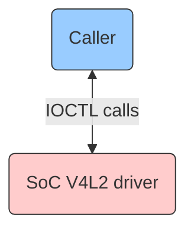
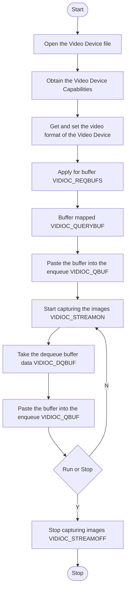

# V4L2 Documentation

## Version History

| Date [DD/MM/YY] | Comment | Version |
| --- | --- | --- |
| 08/08/23 | First Release | 1.0.0 |

## Table of Contents

- [Acronyms, Terms and Abbreviations](#acronyms-terms-and-abbreviations)
- [Description](#description)
  - [Introduction](#introduction)
  - [References](#references)
- [Component Runtime Execution Requirements](#component-runtime-execution-requirements)
  - [Initialization and Startup](#initializatio-and-startup)
  - [Threading Model](#threading-model)
  - [Process Model](#process-model)
  - [Memory Model](#memory-model)
  - [Power Management Requirements](#power-management-requirements)
  - [Asynchronous Notification Model](#asynchronous-notification-model)
  - [Blocking calls](#blocking-calls)
  - [Internal Error Handling](#internal-error-handling)
  - [Persistence Model](#persistence-model)
- [Non-functional requirements](#non-functional-requirements)
  - [Logging and debugging requirements](#logging-and-debugging-requirements)
  - [Memory and performance requirements](#memory-and-performance-requirements)
  - [Quality Control](#quality-control)
  - [Licensing](#licensing)
  - [Build Requirements](#build-requirements)
  - [Variability Management](#variability-management)
  - [Platform or Product Customization](#platform-or-product-customization)
- [Interface API Documentation](#interface-api-documentation)
  - [Theory of operation and key concepts](#theory-of-operation-and-key-concepts)
  - [V4L2 IOCTL for SOC Implementation](#v4l2-ioctl-for-soc-implementation)
  - [Diagrams](#diagrams)
    - [IOCTL Call Flow when capturing images](#ioctl-call-flow-when-capturing-images)
    - [General IOCTL Call Flow](#general-ioctl-call-flow)

## Acronyms, Terms and Abbreviations

- `HAL`    - Hardware Abstraction Layer
- `API`    - Application Programming Interface
- `Caller` - Any user of the interface via the IOCTLs
- `SoC`    - System on Chip
- `V4L2`   - Video For Linux version 2
- `IOCTL`  - Input-Output Control

## Description
This interface provides a set of `IOCTL` calls that are required to be supported by the `SoC's` `V4L2` driver. Any of the layers calling the `V4L2`, must be referred as `caller`.
The diagram below shows the interaction between `caller` and `SoC` `V4L2` Driver.

### Introduction
The `V4L2` functionality enables video playback applications to easily display video content on a variety of embedded Linux devices with different video output capabilities. `V4L2` framework provides a standardized and flexible interface for working with video devices on Linux-based systems. By providing a common `API` for accessing and controlling video devices, `V4L2` simplifies the development of video applications and drivers, and enables interoperability across different hardware platforms and drivers.

For example, when a user-space application requests a video frame, the `V4L2` driver captures the frame from the device using the configured communication channels and stores it in a buffer. The user-space application can then read the frame from the buffer and process it as needed. Similarly, when a user-space application requests output to a display device, the `V4L2` driver outputs the video frames to the appropriate destination. During video playback, the video frames are sent to the video output device using the `V4L2` `IOCTL` calls which handles the low-level details of displaying the frames on the screen.

### References
Video4Linux Devices Specifications - [Video4Linux devices](https://www.kernel.org/doc/html/v5.4/media/kapi/v4l2-core.html "Video4Linux devices")

## Component Runtime Execution Requirements
These requirements ensure that the `HAL` executes correctly within the run-time environment that it will be used in. Failure to meet these requirements will likely result in undefined and unexpected behaviour.

### Initialization and Startup
The `V4L2` driver provides the interface between the `caller` and the video device. Once the `caller` successfully opens the video device file (available as /dev/videoX; where X is a non-negative integer) with read and write permissions (`O_RDWR`) using the `open()` system call and sets the `O_CLOEXEC` flag, it will then use subsequent `V4L2`-specific `IOCTL` calls to interact with the driver and perform operations. With `VIDIOC_QUERYCAP` the `caller` will get the device hardware capabilities.

### Threading Model
`HAL` shall be thread safe. Any `caller` invoking the `IOCTLs` must ensure calls are made in a thread safe manner. There is no restriction on the vendor to create any number of threads to meet the operational requirements.

### Process Model
This interface supports multiple instantiation with a single process. The `V4L2` driver is expected to support multiple opens. `EBUSY` will be returned if the driver does not support multiple opens and the device is already in use. Merely opening a `V4L2` device does not grant exclusive access. Initiating data exchange however, assigns the right to read or write the requested type of data and to change related properties, to this file descriptor. `Caller` can request additional access privileges using the priority mechanism. Refer [<b>this link</b>.](https://www.kernel.org/doc/html/next/userspace-api/media/v4l/open.html "Multiple Opens")

### Memory Model
The memory model of this interface needs to be taken care by the `SoC's` `V4L2` driver only, with respect to the `IOCTL` calls which are required by the `caller`. By utilizing these `IOCTL` calls, `caller` will interact with `V4L2` and manage the memory model for the video frames. The choice of memory type chosen by the `caller` and `V4L2` driver must be able to support at least these two memory types: `V4L2_MEMORY_MMAP` and `V4L2_MEMORY_DMABUF`.

### Power Management Requirements
There is no requirement for the component to participate in power management. In general, the `SoC` `V4L2` driver must be designed to minimize the power consumption of the device.

### Asynchronous Notification Model
The following `IOCTL` calls, namely `VIDIOC_SUBSCRIBE_EVENT`, `VIDIOC_UNSUBSCRIBE_EVENT` and `VIDIOC_DQEVENT` support an asynchronous notification model as they enable the `caller` to receive video events asynchronously, indicating changes or occurrences in the video device or system. Other `IOCTLs` primarily involve configuration, control, streaming, buffer management, or retrieval of information, but they do not have built-in mechanisms for asynchronous event handling or notifications.

-  <b>`VIDIOC_SUBSCRIBE_EVENT`:</b> This `IOCTL` call allows the `caller` to subscribe to video events generated by a video device asynchronously. Once subscribed, the `caller` can receive notifications about specific events asynchronously, indicating changes or occurrences in the video device.

- <b>`VIDIOC_UNSUBSCRIBE_EVENT`:</b> This `IOCTL` call cancels the subscription to video events previously established using `VIDIOC_SUBSCRIBE_EVENT`. It stops the asynchronous event notifications from being received by the `caller`.

- <b>`VIDIOC_DQEVENT`:</b> This `IOCTL` call  dequeues a video event generated by a video device. It allows the `caller` to retrieve the event information asynchronously, indicating the occurrence of a specific event.

The `V4L2` driver is required to support at least these four event types: `V4L2_EVENT_ALL`, `V4L2_EVENT_SRC_CH_RESOLUTION`, `V4L2_EVENT_SOURCE_CHANGE` and `V4L2_EVENT_EOS`. Refer: [V4L2 Event Types](https://www.kernel.org/doc/html/v5.4/media/uapi/v4l/vidioc-dqevent.html#event-type "V4L2 Event Types")

### Blocking calls
None of the calls in the interface must block.

### Internal Error Handling
All the `IOCTLs` must return error synchronously as a return argument. Please refer to [<b>V4L2 General Errors</b>](https://www.kernel.org/doc/html/v5.4/media/uapi/gen-errors.html. "V4L2 General Errors").
`HAL` is responsible for handling system errors (e.g. out of memory) internally.

### Persistence Model
There is no requirement for the interface to persist any setting information. 

## Non-functional requirements

### Logging and debugging requirements
This interface is required to support DEBUG, INFO and ERROR messages. ERROR logs must be enabled by default. DEBUG and INFO is required to be disabled by default and enabled when needed.

### Memory and performance requirements
This interface is required to not cause excessive memory and CPU utilization.

### Quality Control

- This interface is required to perform static analysis, our preferred tool is Coverity.
- Have a zero-warning policy with regards to compiling. All warnings are required to be treated as errors.
- Copyright validation is required to be performed, e.g.: Black duck, FossID.
- Use of memory analysis tools like Valgrind are encouraged to identify leaks/corruptions.
- `HAL` Tests will endeavour to create worst case scenarios to assist investigations.
- Improvements by any party to the testing suite are required to be fed back.

### Licensing
The `HAL` implementation is expected to released under the Apache License 2.0.

### Build Requirements
`V4L2` driver will be implemented as a kernel module. `SoC` team is expected to handle the compilation of `V4L2` driver as part of kernel and need to enable the configuration options required for adding `V4L2` driver in the kernel for supporting V4L protocol based decoding components. The driver modules plug into the videodev kernel module. Also, the driver's linux kernel is expected to be at least `5.4.0`. Refer [<b>this link</b>](https://www.kernelconfig.io/index.html "Kernel configuration") for necessary configuration options.

The build mechanism must be independent of Yocto.

### Variability Management
Any changes in the `APIs` must be reviewed and approved by the component architects. Further support may be added to test any specific requirements of the target platform or product.

### Platform or Product Customization
This interface is not required to have any platform or product customizations.

## Interface API Documentation
`API` documentation will be provided by Doxygen which will be generated from the header files.

### Theory of operation and key concepts
The `caller` is expected to have complete control over calling the `V4L2` `IOCTLs`.

Operation of `V4L2` typically involves the following steps:

- <b>Device Detection and Opening:</b> The `caller` initiates the process by detecting (using `opendir()` & `readdir()`) given with full path (/dev/videoX) and attempting to open the video device file using the `open()` system call. The `caller's` file system layer handles the mapping of the specified device file to the corresponding driver. On success, `open()` returns the new file descriptor. On error, -1 is returned, and the `errno` variable is set appropriately.The `V4L2` driver, once accessed through the opened device file, provides the necessary interface for the `caller` to communicate with the video device.

- <b>Device Capabilities Query:</b> After opening the device, `caller` must query the `V4L2` framework for driver and hardware capabilities using `VIDIOC_QUERYCAP`. The `IOCTL` call takes a pointer to a struct `v4l2_capability` which is filled by the driver. When the driver is not compatible with this specification, the `IOCTL` call returns an `EINVAL` error code. `SoC` `V4L2` driver must support these device capabilities flags: `V4L2_CAP_DEVICE_CAPS`, `V4L2_CAP_STREAMING` and `V4L2_CAP_VIDEO_M2M`/`V4L2_CAP_VIDEO_M2M_MPLANE`.

- <b>Stream Configuration:</b> To prepare the video device for capturing video data, the `V4L2` interface configures various streaming parameters, such as the desired image format, buffer type and frame sizes. This step ensures that the video device is set up correctly for capturing video in the specified format.

- <b>Memory Mapping:</b> `V4L2` provides memory mapping mechanisms to efficiently transfer video frames between the video device and the `caller`. This process involves allocating memory buffers in the system, which will be used to store the captured video frames. Once `VIDIOC_QUERYBUF` is called and the buffer is ready, it will be copied into the enqueue using `VIDIOC_QBUF`.

- <b>Stream Activation:</b>  Once the device is properly configured and memory buffers are allocated, the `V4L2` interface activates the video stream using `VIDIOC_STREAMON`. This step starts the flow of video frames from the device to the allocated memory buffers, allowing the `caller` to access and process the captured video data.

- <b>Data Processing and Utilization:</b> Once the video stream is active, the `caller` can retrieve the captured video frames from the memory buffers and process them for various purposes. This may include displaying the video feed on a screen using `VIDIOC_DQBUF`, saving the video to a file, performing real-time analysis, or integrating the video data into other applications.

For `SoC` Implementation, `V4L2` driver is required to support these `19` `IOCTL` calls:

- `VIDIOC_CROPCAP`
- `VIDIOC_G_CTRL`
- `VIDIOC_STREAMOFF`
- `VIDIOC_STREAMON`
- `VIDIOC_DECODER_CMD`
- `VIDIOC_QUERYCAP`
- `VIDIOC_SUBSCRIBE_EVENT`
- `VIDIOC_UNSUBSCRIBE_EVENT`
- `VIDIOC_DQEVENT`
- `VIDIOC_S_FMT`
- `VIDIOC_G_FMT`
- `VIDIOC_ENUM_FRAMESIZES`
- `VIDIOC_ENUM_FMT`
- `VIDIOC_QUERYBUF`
- `VIDIOC_REQBUFS`
- `VIDIOC_QBUF`
- `VIDIOC_EXPBUF`
- `VIDIOC_DQBUF`
- `VIDIOC_G_SELECTION`

Refer [<b>this link</b>](https://www.kernel.org/doc/html/v5.4/media/uapi/v4l/user-func.html "V4L2 User Functions") for functions' reference.

`SoC` vendors can refer this [<b>header file link</b>](https://git.linuxtv.org/v4l-utils.git/tree/include/linux/videodev2.h?h=stable-1.18 "V4L2 Header File") for `API` implementation.

### Diagrams

#### IOCTL Call Flow when capturing images

#### General IOCTL Call Flow

```mermaid

sequenceDiagram
participant Caller
participant SoC V4L2 Driver

Caller-->>SoC V4L2 Driver: Opening video device file
SoC V4L2 Driver-->>Caller: open() success

Note right of Caller: To check if device is multiplane and support both capture & output buffertype(ie: device is M2M)
Caller->>SoC V4L2 Driver: VIDIOC_QUERYCAP
SoC V4L2 Driver-->>Caller: Returns device capabilities

Note right of Caller: To query about the controls available​: <br/> V4L2_CID_MIN_BUFFERS_FOR_CAPTURE <br/> V4L2_CID_MIN_BUFFERS_FOR_OUTPUT
Caller->>SoC V4L2 Driver: VIDIOC_G_CTRL​
SoC V4L2 Driver-->>Caller: Returns minimum number of buffers
Caller->>SoC V4L2 Driver:to set private  controls
SoC V4L2 Driver-->>Caller:Returns 0 on successful operation

Note right of Caller: To enumerate all image formats supported by the driver
Caller->>SoC V4L2 Driver: VIDIOC_ENUM_FMT
SoC V4L2 Driver-->>Caller: Returns information on supported image formats

Note right of Caller: To enumerate the frame size associated with each pixel format
Caller->>SoC V4L2 Driver: VIDIOC_ENUM_FRAMESIZES
SoC V4L2 Driver-->>Caller: Returns frame sizes corresponding to each format

Note right of Caller: To get the supported image format
Note right of Caller: for encoded data use: V4L2_BUF_TYPE_VIDEO_OUTPUT/ V4L2_BUF_TYPE_VIDEO_OUTPUT_MPLANE  
Note right of Caller: for decoded data use: V4L2_BUF_TYPE_VIDEO_CAPTURE/ V4L2_BUF_TYPE_VIDEO_CAPTURE_MPLANE
Caller->>SoC V4L2 Driver: VIDIOC_G_FMT
SoC V4L2 Driver-->>Caller: Returns current supported image formats

Note right of Caller: To set the pixel format such as: <br/>V4L2_PIX_FMT_H264 (input) <br/> V4L2_PIX_FMT_NV12 (output)
Caller->>SoC V4L2 Driver: VIDIOC_S_FMT
SoC V4L2 Driver-->>Caller:Returns 0 on setting the image format

Note right of Caller: To request driver the number of input/output buffers to allocate frames
Caller->>SoC V4L2 Driver: VIDIOC_REQBUF
SoC V4L2 Driver-->>Caller: Returns number of actual allocated buffer

Note right of Caller: To know the buffer status
Caller->>SoC V4L2 Driver: VIDIOC_QUERYBUF
SoC V4L2 Driver-->>Caller: Returns current status of buffer

rect rgb(191, 225, 255)
loop Caller requests the driver to enqueue each frame

Note right of Caller: To enqueue the buffer
Caller->>SoC V4L2 Driver: VIDIOC_QBUF

Note over SoC V4L2 Driver:All buffers are queued before<br/>starting the video streaming
SoC V4L2 Driver->>Caller:Returns 0 on successful operation
end
end

Note right of Caller:Subscribe to V4L2 events
Caller->>SoC V4L2 Driver: VIDIOC_SUBSCRIBE_EVENT
SoC V4L2 Driver-->>SoC V4L2 Driver: Subscribe events
SoC V4L2 Driver->>Caller: Returns 0 on successful operation

Note right of Caller:Caller starts the acquisition chain
Caller->>SoC V4L2 Driver: VIDIOC_STREAMON
SoC V4L2 Driver->>Caller:Returns 0 on successful operation

Note right of Caller: Subscribed events are dequeued using VIDIOC_DQEVENT ioctl
Caller->>SoC V4L2 Driver: VIDIOC_DQEVENT
SoC V4L2 Driver-->>SoC V4L2 Driver: Source change or EOS event triggered
SoC V4L2 Driver->>Caller: Returns 0 on successful operation

rect rgb(191, 225, 255)
loop main streaming loop

Note right of Caller: To dequeue the buffer
Caller->>SoC V4L2 Driver: VIDIOC_DQBUF
SoC V4L2 Driver->>Caller:Returns 0 on successful operation
SoC V4L2 Driver--)Caller:An uncompressed frame is ready

Note over SoC V4L2 Driver:VIDIOC_DQBUF/QBUF mechanism is <br/>repeated to get each frame sequentially
Caller-->>Caller:Get the frame data

Note right of Caller: To re-enqueue the buffer
Caller->>SoC V4L2 Driver: VIDIOC_QBUF
SoC V4L2 Driver->>Caller:Returns 0 on successful operation
end
end

Note right of Caller: Caller stops the acquisition with this IOCTL
Caller->>SoC V4L2 Driver: VIDIOC_STREAMOFF
SoC V4L2 Driver->>Caller: Returns 0 on successful operation

Note over Caller:when playback stops
Note right of Caller: Unsubscribe V4L2 event
Caller->>SoC V4L2 Driver: VIDIOC_UNSUBSCRIBE_EVENT
SoC V4L2 Driver-->>SoC V4L2 Driver: Unsubscribe all events
SoC V4L2 Driver->>Caller: Returns 0 on successful operation

Caller-->>SoC V4L2 Driver: Closing video device file
SoC V4L2 Driver-->>Caller: close() success

```

